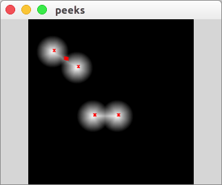

# find peeks for gray image
This algorithm is useful for find regional maxima in gray image or matrix

<div class="fig figcenter fighighlight">
  
  <div class="figcaption"></div>
</div>

##  install OpenCV 
if you did not install OpenCV, install it. 

## install cmake
```
sudo apt-get install cmake
```

## build
```
mkdir build
cd build
cmake ..
make
```

## run
```
./findpeeks_queue
```
